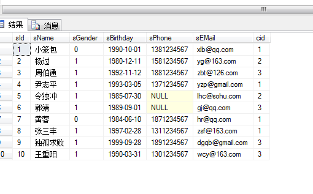
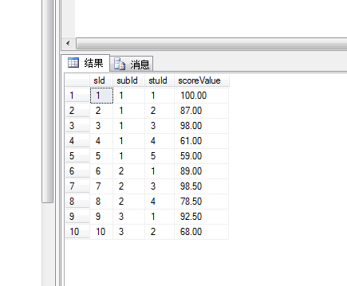
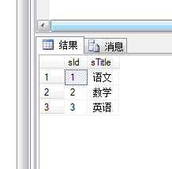
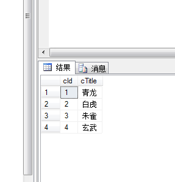

# server 08 数据库

## 1.安装数据库

## 2.设置基本tcp/ip链接。

## 3.简单界面，创建数据库


## 4.生成2个数据库文件，怎样移动和导入

一般复制不了，要提示权限，要想复制，先要右键，任务，分离


分离之后要导入，右键数据库，附加


## 5.假设我不想要移动数据库文件，麻烦，右键，任务，生成脚本。


## 6.创建表，指定主键，标识规范，交由server维护。


=======


## 7.设置唯一健，不重复，

选择其中一列，右键，索引，唯一值


## 8.设置默认字符串。


## 9.设置检查

右键-check-约束-输入表达式，跟函数联系在一起


## 10.关系，邮件，关系


## 11.设置能修改表，不然修改都会提示报错、


## 12设置外键链接主建，列名必须相同，通过下拉框选择

被决定的那张表是外键表，起决定的那张表是主键表


## 13.sql语言使用

1.利用master表查看数据库有没有你那张表

```
select * from sysdatabases
```

2.利用脚本文件创建,在这里最好主文件名叫_data,日志文件名叫_log

多个列间使用逗号分隔
	主键：primary key
	非空：not null
	惟一：unique
	默认：default()
	检查：check()
	外键：foreign key(列名) references 表名(列名)

```sql
create database test
on
(name='test_data',
filename='d:\test_data.mdf',
size=10mb,
filegrowth=10% )
log on
(name= 'test_log',
filename='d:\test_log.ldf',
size=3mb,
filegrowth=1mb)

使用test库
use test
创建班级表
create table classInfo
(
cid int not null primary key identity(1,1),
cname nvarchar(15) not null
)

创建学生表
create table stuInfo
(
sid int not null primary key identity(1,1),
sname nvarchar(10),
sgender bit default(0),
sbirthday date ,
sphone char(14),
semail varchar(20),
cid int not null,
foreign key (cid) references classInfo (cid)
)

主键加后面的增长策略， 外键与classInfo关联
增
insert into user2 (uname,paw) values('关羽','21232F297A57A5A743894A0E4A801FC3')
连续插入多个值，可以values后面加逗号隔开

insert  user2 (uname) values('张飞'),('赵云')

改
update user2 set uname='曹操' where uid=8


删
delete from user2 where uid=8

清空：truncate table 表名
清空表格的同时，把里面的规则也重置
```

常用辅助命令及快捷键
	set statistics time on/off：在消息栏显示详细执行时间
	ctrl+e执行
	ctrl+r隐藏消息栏
	ctrl+l计划任务，对sql语句进行分析

3.查询

top

```sql
select top 2 *
from user2

select top 10 percent*
from user2

-》排序：order by 列名1 asc|desc,列名1 asc|desc...
-》消除重复行：distinct

select * from user2 order by uid desc，cid asc

select distinct cid from user2
排除重复的


where 关键字，查找uid介于3跟8之间
select * from user2 where uid between 3 and 8

select * from user2 where int （1,3)

```

条件查询：写在where后面
	对行进行筛选，返回bool类型的值，如果某行中的列数据满足条件，则加入结果集，否则不出现在结果集中
	比较运算符：=，>，>=，<，<=，!=或<>
	between ... and ...表示在一个连续的范围内
	in表示在一个非连续的范围内
	逻辑运算符：and，or，not
	模糊查询：用于处理字符串类型的值，运算符包括：like % _ [] ^
		%与_写在[]中表示本身的含义
		在[]表示一个连续的范围可以使用-
		^写在[]内部的开头，表示不使用内部的任何字符
	null的判断：使用is null或is not null，与其它值计算时返回null，排序时null被认为是最小
	优先级：**小括号，not，比较运算符，逻辑运算符**

```
select * from user2 uname like '%张%'
%代表任意多个字符

select * from StudentInfo where sPhone like '1[^5]%'
选取手机号码第一个字符为1，第二个字符不是5的手机号码
```

4.连接查询

join 表名 on 关联条件
	内连接：inner join，两表中完全匹配的数据（一般是主键链接到另一个表的外键）
	左外连接：left outer join，两表中完全匹配的数据，左表中特有的数据
	右外连接：right outer join，两表中完全匹配的数据，右表中特有的数据
	完全外连接：full outer join，两表中完全匹配的数据，左表中特有的数据，右表中特有的数据，两边不同的数据都会出来

现有三张表，查询出学生姓名，学生科目，对应的学生成绩。

学生表



成绩表



科目表



```sql

查找学生姓名，科目及对应成绩
select stu.sName,sub.sTitle,sco.scoreValue
from StudentInfo as stu 
inner join ScoreInfo as sco on stu.sId =sco.stuId
inner join SubjectInfo as sub on sco.subId=sub.sId

关键在于在每个表之间的联系，在每一个表用只有一种联系联系起来
```

班级表



```sql

查找学生姓名，班级，科目及对应成绩
select stu.sName,cla.cTitle,sub.sTitle,sco.scoreValue
from StudentInfo as stu 
inner join ClassInfo as cla on stu.cid=cla.cId
inner join ScoreInfo as sco on stu.sId =sco.stuId
inner join SubjectInfo as sub on sco.subId=sub.sId
这时候只需找到学生表跟班级表之间的联系
```

5.聚合函数

》聚合函数：对行数据进行合并
	sum,avg,count,max,min
	一般是对数字类型的列进行操作
	一条查询中可以同时写多个聚合函数，但是不能与普通列混写
	聚合中的null问题：不参与计算

```sql
求语文的平均分

select AVG(sco.scoreValue) 
from ScoreInfo as sco 
inner join SubjectInfo as sub on sco.subId=sub.sId
where  sub.sTitle='语文'
```

6.开窗函数：over()
	将统计出来的数据分布到原表的每一行中
	结合聚合函数、排名函数使用

当你要使用聚合函数，如果查询要多一个字段，这个时候会报错，应该得到的平均结果只有一个，放到哪一个行都不行

over的作用是将统计结果分部到每一行

```sql
select ScoreInfo.* ,AVG(scoreValue) over()
from ScoreInfo
where subId=1
```

7.分组：group by 列名1,列名2...
	聚合函数一般结合分组使用，进行分组内的数据进行统计
	根据指定列进行分组
	分组后条件筛选：having ...

针对某一列对行进行合并

```sql
select subId ,avg(scorevalue)
from scoreinfo
group by subid


求每个班的男女生的人数
select cid,sgender, COUNT(*)
from StudentInfo
group by cid,sgender
```

