# server 08 数据库

## 1.安装数据库

## 2.设置基本tcp/ip链接。

## 3.简单界面，创建数据库

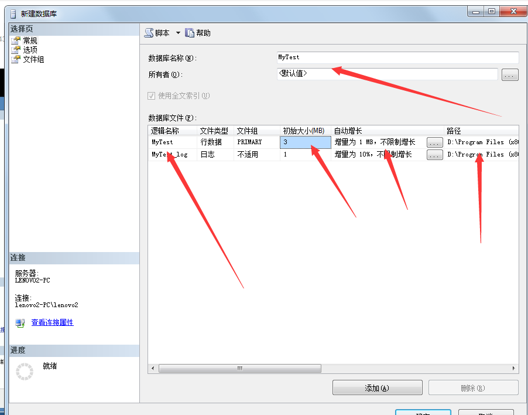

## 4.生成2个数据库文件，怎样移动和导入

一般复制不了，要提示权限，要想复制，先要右键，任务，分离


分离之后要导入，右键数据库，附加

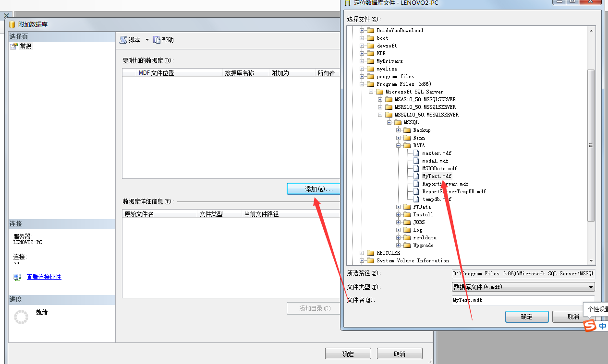

## 5.假设我不想要移动数据库文件，麻烦，右键，任务，生成脚本。

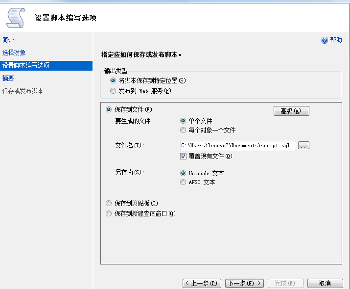

## 6.创建表，指定主键，标识规范，交由server维护。

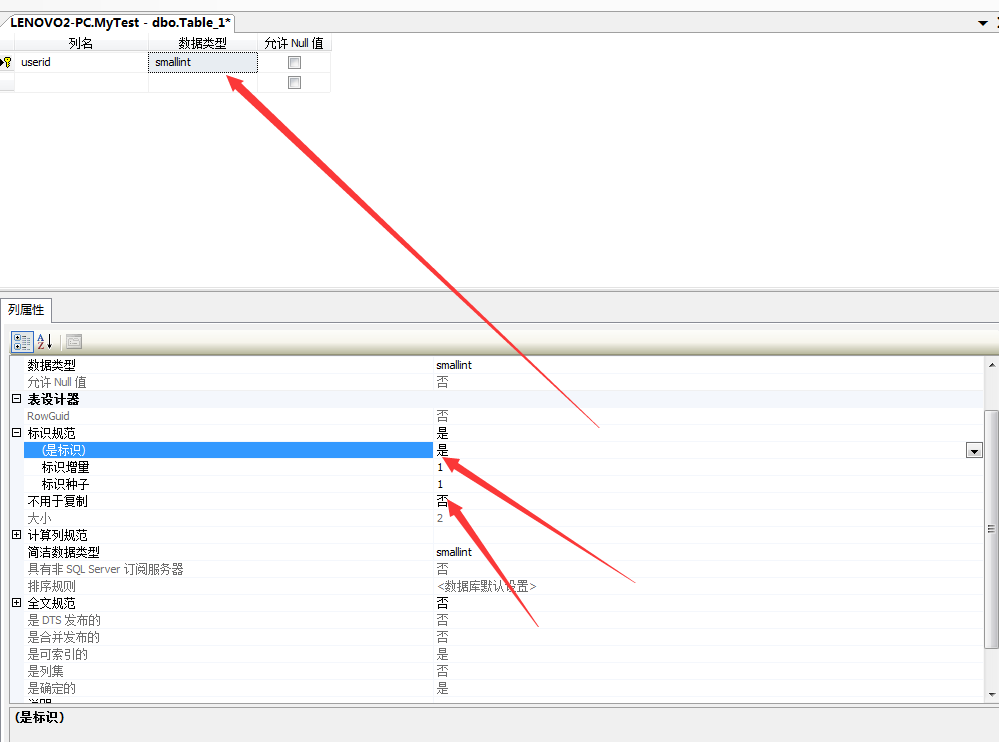
=======


## 7.设置唯一健，不重复，

选择其中一列，右键，索引，唯一值

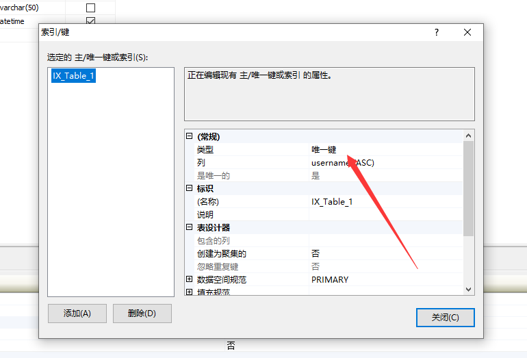

## 8.设置默认字符串。

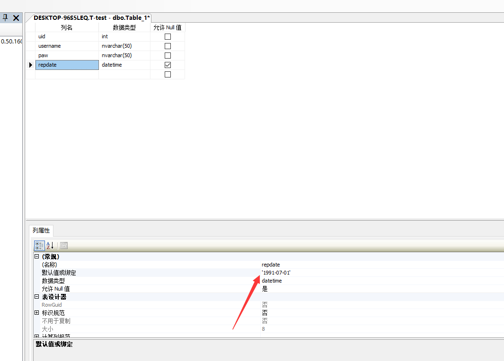

## 9.设置检查

右键-check-约束-输入表达式，跟函数联系在一起


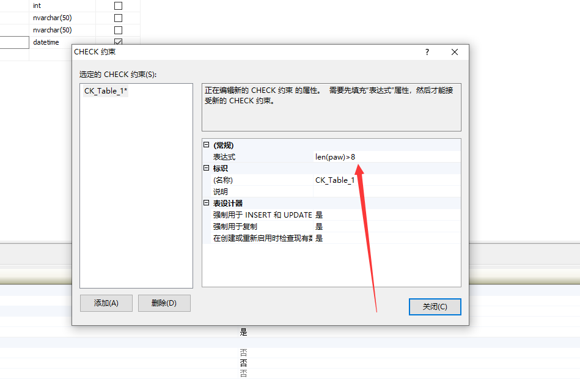

## 10.关系，邮件，关系

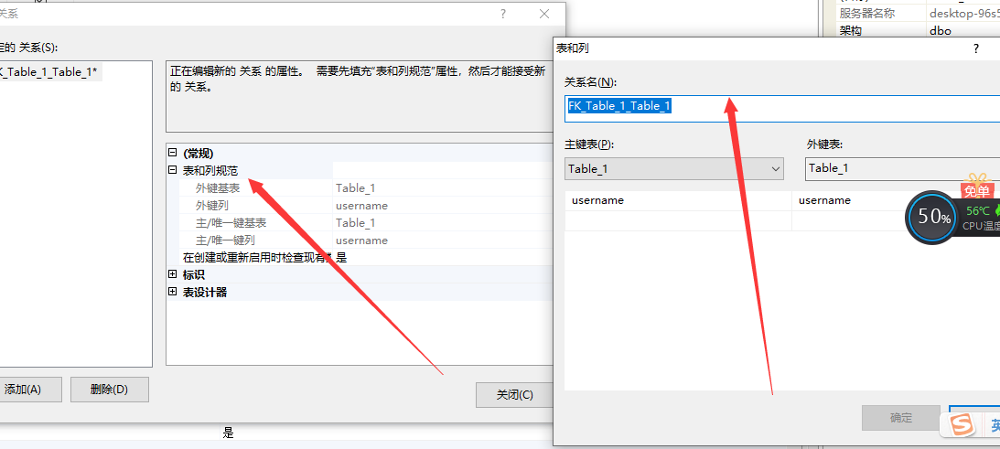
## 11.设置能修改表，不然修改都会提示报错、

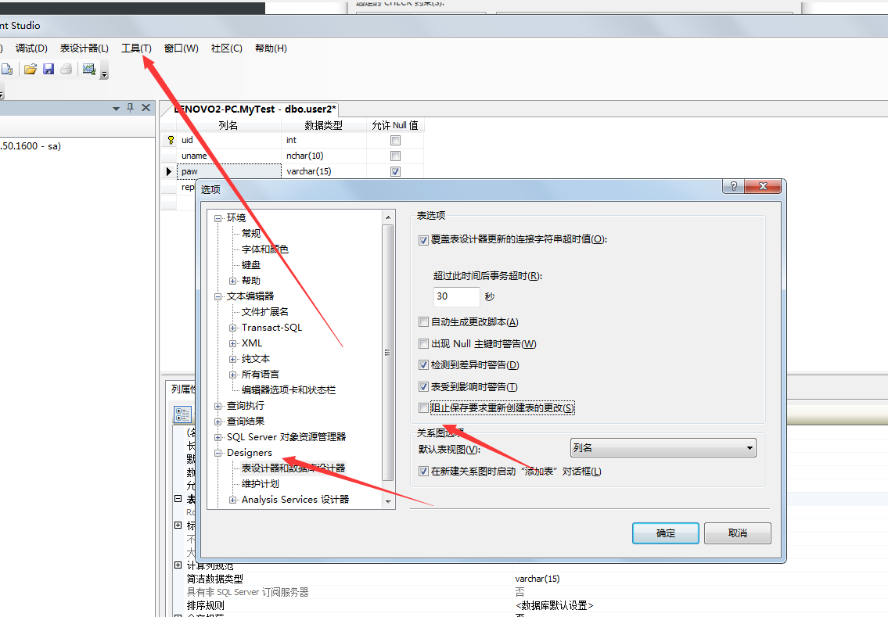

## 12设置外键链接主建，列名必须相同，通过下拉框选择

被决定的那张表是外键表，起决定的那张表是主键表

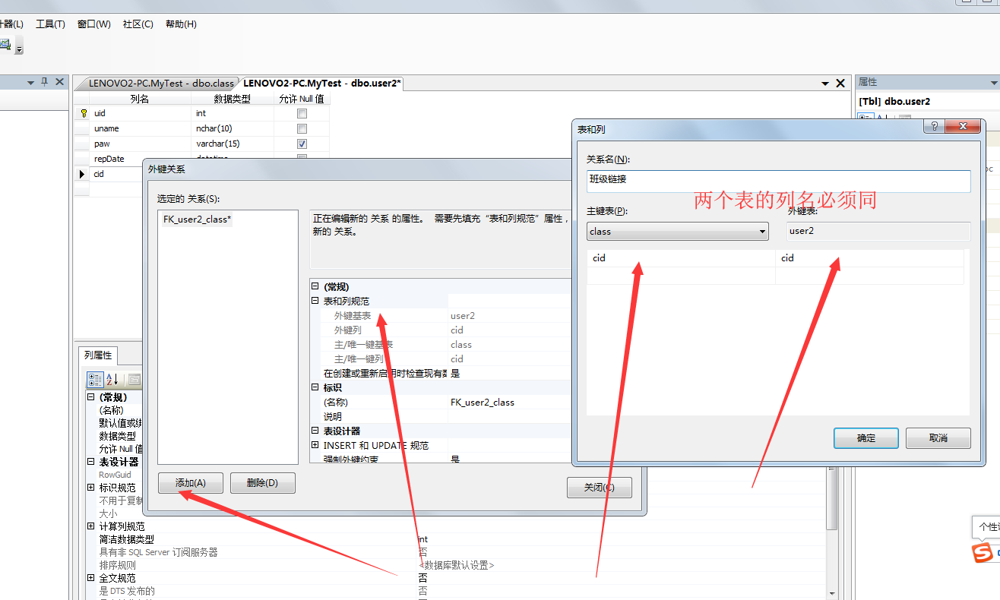

## 13.sql语言使用

1.利用master表查看数据库有没有你那张表

```
select * from sysdatabases
```

2.利用脚本文件创建,在这里最好主文件名叫_data,日志文件名叫_log

多个列间使用逗号分隔
	主键：primary key
	非空：not null
	惟一：unique
	默认：default()
	检查：check()
	外键：foreign key(列名) references 表名(列名)

```sql
create database test
on
(name='test_data',
filename='d:\test_data.mdf',
size=10mb,
filegrowth=10% )
log on
(name= 'test_log',
filename='d:\test_log.ldf',
size=3mb,
filegrowth=1mb)

使用test库
use test
创建班级表
create table classInfo
(
cid int not null primary key identity(1,1),
cname nvarchar(15) not null
)

创建学生表
create table stuInfo
(
sid int not null primary key identity(1,1),
sname nvarchar(10),
sgender bit default(0),
sbirthday date ,
sphone char(14),
semail varchar(20),
cid int not null,
foreign key (cid) references classInfo (cid)
)

主键加后面的增长策略， 外键与classInfo关联
增
insert into user2 (uname,paw) values('关羽','21232F297A57A5A743894A0E4A801FC3')
连续插入多个值，可以values后面加逗号隔开

insert  user2 (uname) values('张飞'),('赵云')

改
update user2 set uname='曹操' where uid=8


删
delete from user2 where uid=8

清空：truncate table 表名
清空表格的同时，把里面的规则也重置
```

常用辅助命令及快捷键
	set statistics time on/off：在消息栏显示详细执行时间
	ctrl+e执行
	ctrl+r隐藏消息栏
	ctrl+l计划任务，对sql语句进行分析

3.查询

top

```sql
select top 2 *
from user2

select top 10 percent*
from user2

-》排序：order by 列名1 asc|desc,列名1 asc|desc...
-》消除重复行：distinct

select * from user2 order by uid desc，cid asc

select distinct cid from user2
排除重复的


where 关键字，查找uid介于3跟8之间
select * from user2 where uid between 3 and 8

select * from user2 where int （1,3)

```

条件查询：写在where后面
	对行进行筛选，返回bool类型的值，如果某行中的列数据满足条件，则加入结果集，否则不出现在结果集中
	比较运算符：=，>，>=，<，<=，!=或<>
	between ... and ...表示在一个连续的范围内
	in表示在一个非连续的范围内
	逻辑运算符：and，or，not
	模糊查询：用于处理字符串类型的值，运算符包括：like % _ [] ^
		%与_写在[]中表示本身的含义
		在[]表示一个连续的范围可以使用-
		^写在[]内部的开头，表示不使用内部的任何字符
	null的判断：使用is null或is not null，与其它值计算时返回null，排序时null被认为是最小
	优先级：**小括号，not，比较运算符，逻辑运算符**

```sql
select * from user2 uname like '%张%'
%代表任意多个字符

select * from StudentInfo where sPhone like '1[^5]%'
选取手机号码第一个字符为1，第二个字符不是5的手机号码
```


5.分组

分组：group by 列名1,列名2...
	聚合函数一般结合分组使用，进行分组内的数据进行统计
	根据指定列进行分组
	分组后条件筛选：having ...

```sql
select gender,count(*) from sudent group  by gender
按照性别分组，统计人数
俗称按照某个列进行分组，在对行进行合并
多列也可以分组，分组的结果是是两个列的组合，在结果集中，分组依据值相同的在一列，在结果列中只能出现分组依据列和聚列
select cid,gender,count(*) from student group by cid,gender


查找学生编号大于2的各个班级，各个新别的人数
select cid,sGender,COUNT(*) as count from StudentInfo
where sid>2
group by cId,sGender 

统计学生编码大于2的各个班级，各个性别的人数，并且人数大于3

select cid,sGender,COUNT(*) from StudentInfo
where sid>2 
group by cId,sGender having COUNT(*)>3

```

6.联合查询

这种情况下列数和属性必须相同，union和union all的区别是，union会自动压缩多个结果集合中的重复结果，而union all则将所有的结果全部显示出来，不管是不是重复。

intersect(交集)

except(差集)集合运算：先将其中完全重复的数据行删除，再返回只在第一个集合中出现，在第二个集合中不出现的所有行。


## 100创建数据库，数据库基本操作

```sql
创建一个学生数据库，并制定三个文件存储，并归为一个文件组
create database student
on primary
(name='student1',
filename='g:\data\student1.mdf',
size=10mb,
filegrowth=10%),
(name='studnet2',
filename='g:\data\student2.ndf',
size=10mb,
filegrowth=10%),
filegroup filedb
(name='studnet3',
filename='g:\data\student3.ndf',
size=10mb,
filegrowth=10%)

use database stu
查看数据库的基本信息
sp_helpdb stu

修改数据库
假设学生数据库由于增加太快，需增加一个文件存储数据
alter database 学生选课
add file 
(name='xsxk1',
filename='g:\data\xsxk1.ndf',
size=10mb,
filegrowth=10%)


数据库重命名
alter database 学生选课
modify name=xsxk


收缩数据库
右键-任务-收缩-文件
ALTER DATABASE database_name SET AUTO_SHRINK ON
alter database xsxk set auto_shrink on
```

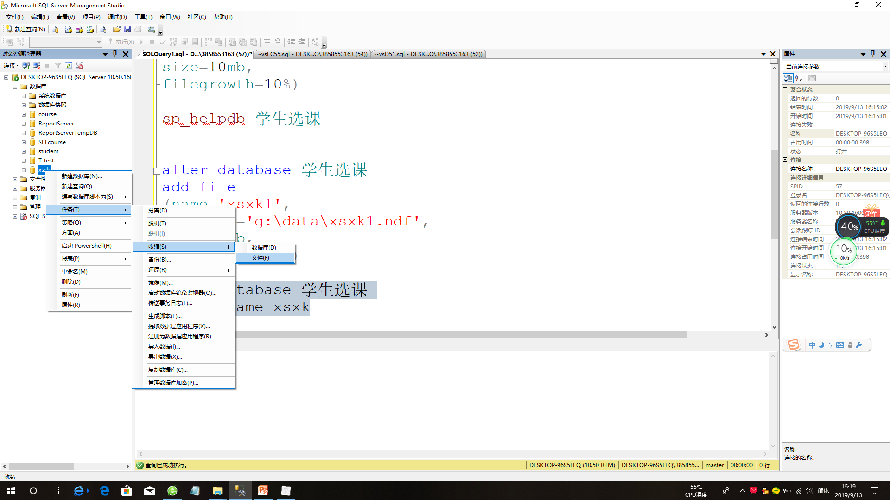

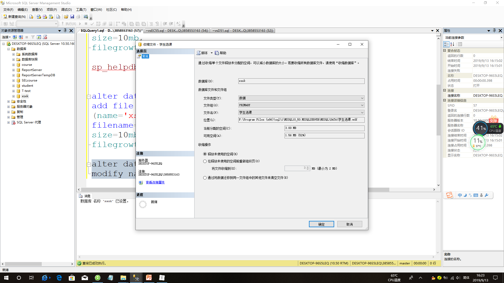

```sql


使用 DBCC SHRINKDATABASE语句实现用户数据库收缩
DBCC SHRINKDATABASE语法格式如下：
DBCC SHRINKDATABASE(database_name,target_percent)
dbcc shrinkdatabase (xsxk,20)


dbcc shrinkfile(course,10)

```

修改数据库的文件组

-

```sql
---创建数据库的时候第一个为主文件，也必须在主文件组里面on primary是主文件组
--之后第二个数据文件之前就可以创建一个文件组。并指定一个数据文件存储，最后在声明一个日志文件。

create database stu
on primary
(
name='stu1',
filename='h:\stu1.mdf',
size=10mb,
filegrowth=10%
),
filegroup fg1
(
name='stu2',
filename='h:\stu2.ndf',
size=10mb,
filegrowth=10%
)
log on
(name='stu_log',
filename='h:\stu_log.ldf',
size=10mb,
filegrowth=10%
)
----这个时候我们可以通过右键属性，查看到第二个文件再文件组里面


USE E_Market
ALTER DATABASE E_Market ADD FILEGROUP FG1
```

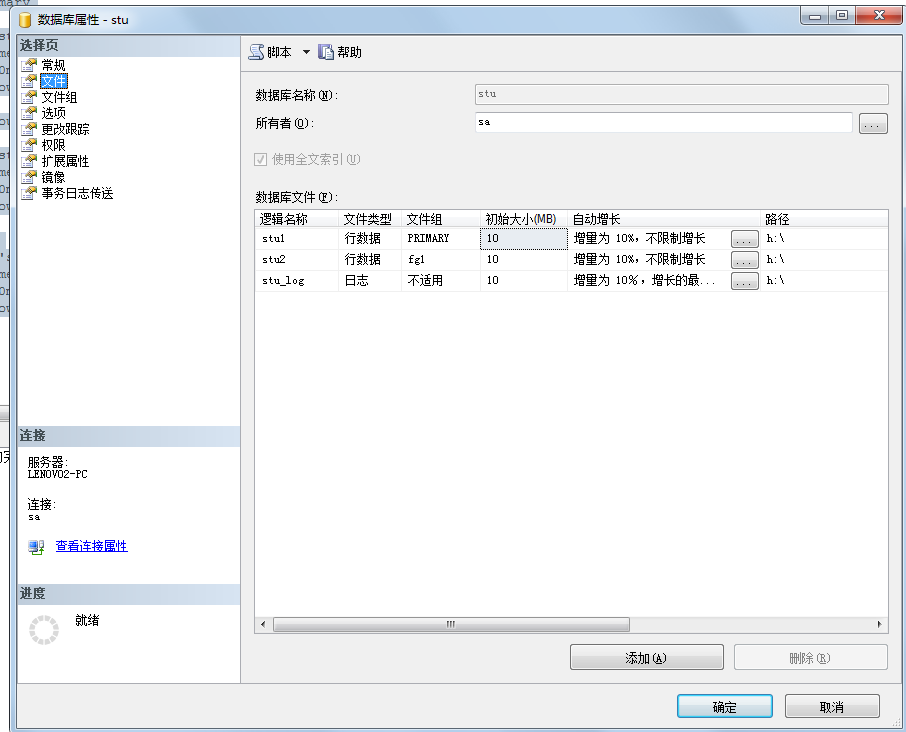


## 4.连接查询

join 表名 on 关联条件
	内连接：inner join，两表中完全匹配的数据（一般是主键链接到另一个表的外键）
	左外连接：left outer join，两表中完全匹配的数据，左表中特有的数据
	右外连接：right outer join，两表中完全匹配的数据，右表中特有的数据
	完全外连接：full outer join，两表中完全匹配的数据，左表中特有的数据，右表中特有的数据，两边不同的数据都会出来

现有三张表，查询出学生姓名，学生科目，对应的学生成绩。

学生表

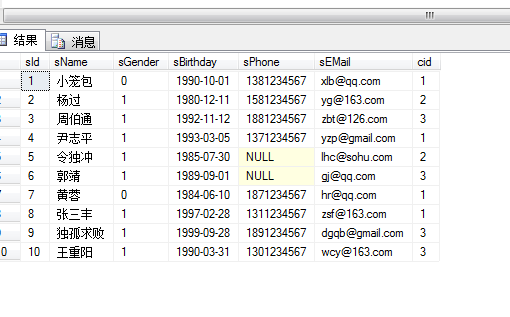

成绩表

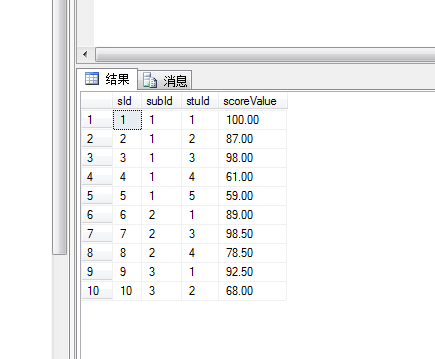

科目表


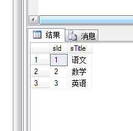

```sql

查找学生姓名，科目及对应成绩
select stu.sName,sub.sTitle,sco.scoreValue
from StudentInfo as stu 
inner join ScoreInfo as sco on stu.sId =sco.stuId
inner join SubjectInfo as sub on sco.subId=sub.sId

关键在于在每个表之间的联系，在每一个表用只有一种联系联系起来
```


学生表

成绩表


科目表


```sql

查找学生姓名，班级，科目及对应成绩
select stu.sName,cla.cTitle,sub.sTitle,sco.scoreValue
from StudentInfo as stu 
inner join ClassInfo as cla on stu.cid=cla.cId
inner join ScoreInfo as sco on stu.sId =sco.stuId
inner join SubjectInfo as sub on sco.subId=sub.sId
这时候只需找到学生表跟班级表之间的联系
```

5.聚合函数

》聚合函数：对行数据进行合并
	sum,avg,count,max,min
	一般是对数字类型的列进行操作
	一条查询中可以同时写多个聚合函数，但是不能与普通列混写
	聚合中的null问题：不参与计算

```sql
求语文的平均分

select AVG(sco.scoreValue) 
from ScoreInfo as sco 
inner join SubjectInfo as sub on sco.subId=sub.sId
where  sub.sTitle='语文'
```

6.开窗函数：over()
	将统计出来的数据分布到原表的每一行中
	结合聚合函数、排名函数使用

当你要使用聚合函数，如果查询要多一个字段，这个时候会报错，应该得到的平均结果只有一个，放到哪一个行都不行

over的作用是将统计结果分部到每一行

```sql
select ScoreInfo.* ,AVG(scoreValue) over()
from ScoreInfo
where subId=1
```

7.分组：group by 列名1,列名2...
	聚合函数一般结合分组使用，进行分组内的数据进行统计
	根据指定列进行分组
	分组后条件筛选：having ...

针对某一列对行进行合并

```sql
select subId ,avg(scorevalue)
from scoreinfo
group by subid


求每个班的男女生的人数
select cid,sgender, COUNT(*)
from StudentInfo
group by cid,sgender

```


101备份

-》向未有表备份：select 列名 into 备份表名 from 源表名
-》说明：备份表可以不存在，会新建表，表的结构完成一致，但是不包含约束
	如果想只包含结构不包含数据，可以加个top 0
-》向已有表备份：insert into 备份表名 select 列名 from 源表名

```sql
从一张表选择所有列到test1表，只会复制数据和标识，没有约束
select * into test1 from StudentInfo

也可以选择一些列
select sId,sName into test2 from StudentInfo

insert into 备份表名 select 列名 from 源表名
insert into test2 select sid,sname from StudentInfo
```

102类型转换

、内置函数
-》类型转换函数：
	cast(expression as data_type)：将任意类型转到到任意类型
	convert(date_type,expression[,style])：将任意类型转到到任意类型
		如果目标类型是字符串，则style可以设置格式，具体格式参考帮助

```sql
select CAST(89.00000 as decimal(4,1))

select CONVERT (decimal(4,1) ,89.000000)
select CAST  (1 as CHAR(1)) +'1'
```

103.视图

2、视图
-》将一个复杂的select语句进行封装，以更方便使用
-》语法：create/alter view 名称
	as
	select ...
	删除：drop view 名称
-》使用：可以将视图名称当作一个表名，进行各种查询操作
-》建议：不要通过视图进行增加、修改、删除，主要进行查询操作

```sql
create view student_class as
select StudentInfo.* ,cTitle from StudentInfo inner join ClassInfo on StudentInfo.cid=ClassInfo.cId
```

104.子查询

根据查询的条件生成结果之后在查询

```sql
select * from student_class where sId in
(select stuId from ScoreInfo)

exists效率稍微高点
select * from StudentInfo where exists
(select * from StudentInfo inner join ScoreInfo on StudentInfo.sId=ScoreInfo.stuId)

```

排序分页

分页：已知页大小、页索引，查询出当前页的数据
	提示1：排名函数row_number()，结合开窗函数over(order by 列名)进行排序号
	提示2：between ... and ...

```sql

select * ,ROW_NUMBER() over (order by sid desc) as rank from student_class where sGender=1
先查找到性别为男的信息
之后用row_numer排序，orver里面是排序规则
as rank是做为一个新列名


利用一个子查询分页
select * from 
(select *,ROW_NUMBER() over (order by sid desc) as row_index from student_class) as t1
where row_index between 5 and 8
将上面的结果扣起来作为一个结果集t1 来查询，然后将索引5到8掉出来
```

105 case条件判断

```sql
select * ,
        case sgender
        when 1 then '男'
        when 0 then '女'
        end as gender
from studentinfo
选择所有信息，将性别为1的判断为男，0为女

select * ,性别1=
		case sgender
		when 1 then '男'
		when 0 then '女'
end 
from studentinfo


--查询学生姓名、科目名称、成绩

select * from ScoreInfo

select sname,stitle,scoreValue from ScoreInfo score
inner join StudentInfo as stu on score.stuId=stu.sId
inner join SubjectInfo as sub on score.subId=sub.sId
再创建视图

create view student_course as
select sname,stitle,scoreValue from ScoreInfo score
inner join StudentInfo as stu on score.stuId=stu.sId
inner join SubjectInfo as sub on score.subId=sub.sId


现在我想以
--姓名 语文 数学 英语
--小笼包 100  89  92.5 这种格式输出数据

这个时候在借助上面视图的情况下
选择了一列姓名，之后就是三个判断标题，为了使三个能共存，就用了最大最小
select sname,
MIN(    case stitle when '语文' then scorevalue end)语文,
MAX(	case stitle when '数学' then scorevalue end)数学,
SUM (  case stitle when '英语' then scorevalue end) 英语
from student_course
group by sName
    


若是想输出
 --班级  男生  女生
--	青龙	 1      2

首先我们先求按班级，和性别分类的并统计人数的视图
create view  student_class as
select ctitle,sGender,COUNT(*) as count from
StudentInfo stu inner join ClassInfo class on stu.cid=class.cId 
group by ctitle,sGender
```

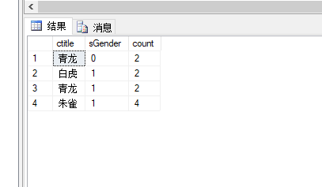


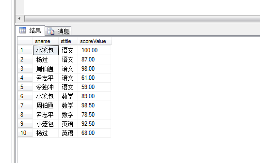

```sql
--之后利用case统计出男，女选项
 --班级  男生  女生
--	青龙	 1      2
select cTitle,
max(case sgender when 0 then count else 0 end )男,
max(case sgender when 1 then count else 0 end )女
from student_class
group by cTitle

```

106 t-sql编程

5、t-sql编程
-》变量
	-》声明：declare 变量名 类型--变量名要求以 @ 开头
	-》设置：set/select 变量名=值
	-》输出：print/select 变量名
	-》全局变量：使用双 @ 符号
		@@version --数据库版本
		@@identity --进行插入后调用，返回最亲的标识值
		@@servername --服务器名称
		@@error --返回执行的上一个 Transact-SQL 语句的错误号，如果没有错误则返回0
		@@rowcount --返回受上一语句影响的行数
-》选择语句if
-》循环语句while
-》异常处理语句
	begin try...end try
	begin catch...end catch

```sql
求1-10之间的偶数
declare @id int
set @id=1
while @id<=10
begin
    if(@id%2=0)
    print @id
    set @id=@id+1
end
    
    
--变量
declare @name nvarchar(10)--声明
set @name='武大头帖'--赋值
print @name--输出

select @@version--查看当前数据库版本

select * from ClassInfo

insert into ClassInfo values('四不像123');
--select @@IDENTITY--最近的insert语句的标识
print @@rowcount

print @@servername

--选择语句
declare @id int
set @id=10
if @id>5
begin
	--满足条件时,执行如下代码
	print 'ok'
end
else
begin
	--不满足条件时,执行如下代码
	print 'no'
end

--循环
declare @id int
set @id=1
while @id<10
begin
	print @id
	set @id=@id+1
end


--异常处理
begin try
	delete from ClassInfo
end try
begin catch
	print @@error
end catch

--事务:保证一个多操作的事情全部完成,否则回到做之前的状态
select * from UserInfo

begin try
	begin tran--设置反悔点,开启事务
	delete from UserInfo where UserId>5
	delete from ClassInfo
	commit tran--不反悔,提交事务
end try
begin catch
	rollback tran--反悔啦,回滚事务
end catch

--锁:防止其它人员的误操作
select * from UserInfo

begin tran
update UserInfo set UserName='abc1' where UserId=10
rollback tran

select * from SubjectInfo
```

106存储过程

就是存储一段你用的上的代码

```sql
create proc trim
	@str1 varchar(10)--参数
as
begin
	select LTRIM(RTRIM(@str1))--代码体
end
--'abc'
exec trim '  abc  '


--编写存储过程,查询表中的总数据,及当前页的数据
--pageindex,pagesize
--output 的作用是然这个参数可以作为参数输出，因为程序只能输出一个结果，而用法是在定义参数的时候定义，用的时候也要加output
create proc GetPageList
	@pageIndex int,
	@pageSize int,
	@rowsCount int output
as
begin
	SET NOCOUNT ON;
	select @rowsCount=COUNT(*) from StudentInfo where IsDelete=0
	
	select * from 
	(select *,ROW_NUMBER() over(order by sid desc) as rowIndex
	from StudentInfo where IsDelete=0) as t1
	where rowindex between (@pageIndex-1)*@pageSize+1 and @pageIndex*@pageSize
end

在对象资源管理器----点开你想要的数据库--可编程性---存储过程

--使用方法,作为参数时也要加个output
declare @temp int
exec GetPageList 1,2,@temp output
print @temp
```

107索引

是什么？相当于书的目录，字典的检索，实现了数据的快速查找
-》分类：
	聚集索引：与实际存储位置一样，一个表中只能有一个聚集索引，主键采用聚集索引，新华词典是按字母排列的，字母就是聚集索引
	非聚集索引：索引顺序与存储顺序不一致。如学生在教室中的位置，可以按年龄进行查找，也可以按身高进行查找，新华词典是按字母进行排列的，但我们可以通过偏旁部首进行查找，偏旁就是非聚集索引，他跟实际存储的逻辑规则（字母）不一样

-》建索引：
	界面：右击表-》索引，添加-》选择列
	代码：create [unique] nonclustered index ix_索引名 on 表名(字段1 asc|desc,...)

右键表--设计---点击任意一列---右键--索引---添加-------这个时候要选要索引的例

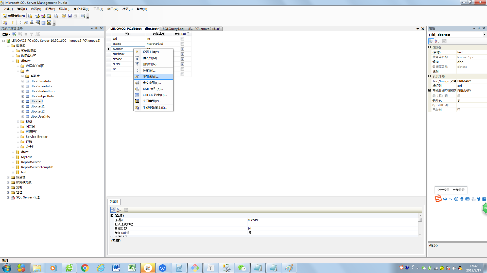


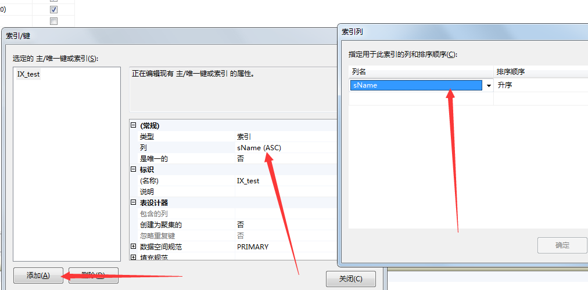

```sql
我们首先查看学生表的数据，在把学生表复制一份到test表，用脚本复制只会复制他的值，不会复制约束
select *from StudentInfo
select *into test from StudentInfo


用脚本创建，nonclustered index 后面加自己定义的名字，on后面加表名字（列名)
create nonclustered index sphone_index on test(sphone)


SET STATISTICS TIME { ON | OFF }显示统计时间
```


## 第四章 创建表

1.自定义数据类型

找到你想好的数据库stu----可编程性----类型----用户定义数据类型---右键

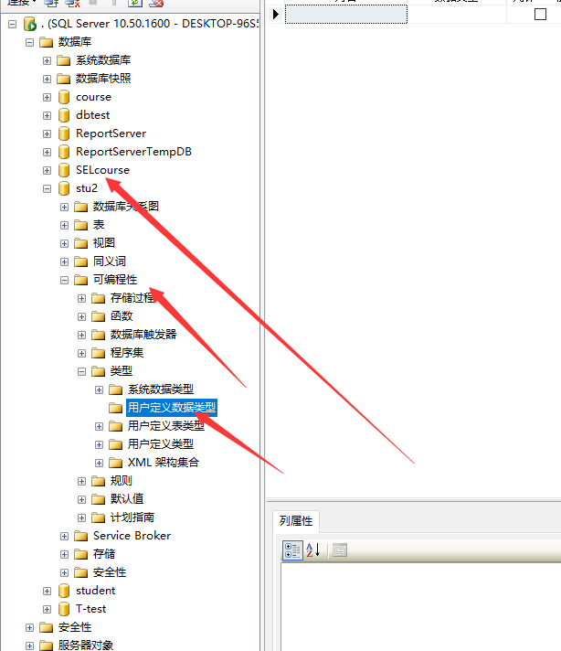


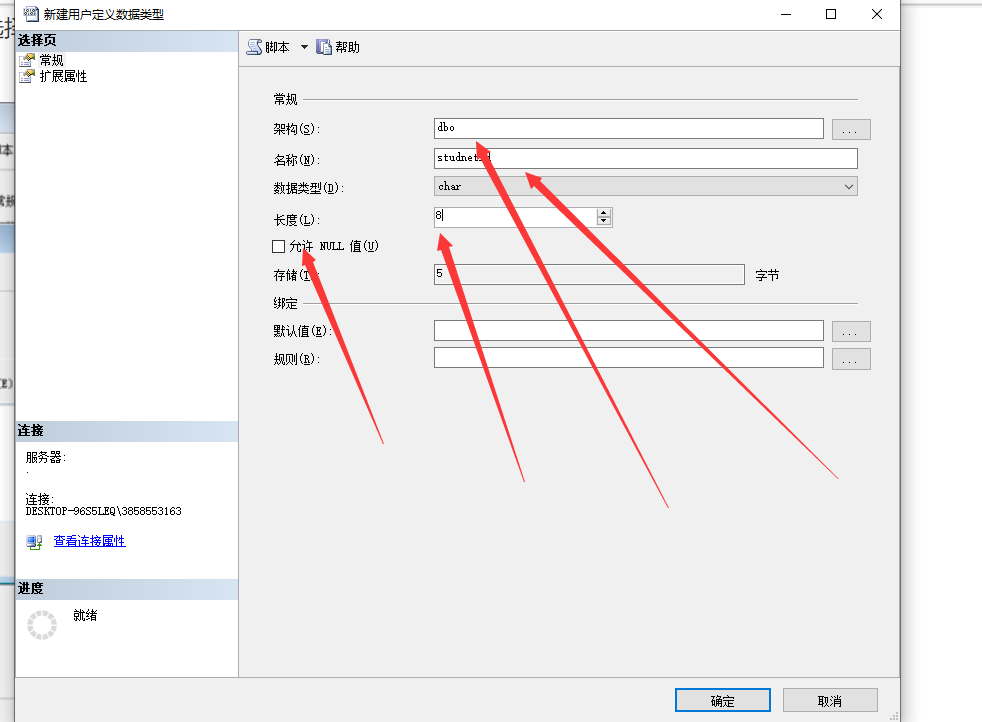

```sql
use stu2
go
exec sp_addtype courseid ,'tinyint','not null'


如果单独执行一条语句就不用什么go,exec
当要执行三条语句，也就是批处理的时候要go,exex
```

